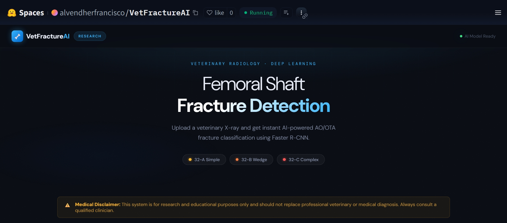

# 🦴 VetFractureAI

**Femoral Shaft Fracture Detection & AO/OTA Classification in Dogs and Cats**

## Demo

[](./assets/vet-fracture-ai-demo.gif)

## What It Does

VetFractureAI uses **Faster R-CNN (ResNet-50 + FPN V2)** to detect and classify femoral shaft fractures in veterinary X-rays according to the **AO/OTA classification system**.

| Class    | Description                     |
| -------- | ------------------------------- |
| **32-A** | Simple fracture (two fragments) |
| **32-B** | Wedge fracture                  |
| **32-C** | Complex / comminuted fracture   |

## Results

### Overall Test Set Performance

| Metric                     | Score      |
| -------------------------- | ---------- |
| mAP@0.5                    | **88.36%** |
| Average IoU                | **77.69%** |
| Accuracy                   | **77.89%** |
| Macro Precision            | **77.64%** |
| Macro Sensitivity (Recall) | **77.64%** |
| Macro Specificity          | **97.83%** |
| Macro F1-Score             | **77.52%** |

### Per-Class Performance

| Class        | Precision | Recall | F1-Score |
| ------------ | --------- | ------ | -------- |
| No Fracture  | 0.918     | 0.978  | 0.947    |
| 32-A Simple  | 0.804     | 0.774  | 0.789    |
| 32-B Wedge   | 0.565     | 0.619  | 0.591    |
| 32-C Complex | 0.818     | 0.735  | 0.774    |

## Dataset

1,264 veterinary radiographs (690 dogs, 574 cats) — AP and lateral views, annotated in COCO JSON format via CVAT. Split 70/15/15.

| Species   | No Fracture | 32-A    | 32-B    | 32-C    | Total     |
| --------- | ----------- | ------- | ------- | ------- | --------- |
| Dogs      | 152         | 200     | 150     | 188     | 690       |
| Cats      | 150         | 165     | 133     | 126     | 574       |
| **Total** | **302**     | **365** | **283** | **314** | **1,264** |

Available on Hugging Face: [VetFractureAI-Dataset](https://huggingface.co/datasets/alvendherfrancisco/VetFractureAI-Dataset)

## Quick Start

```bash
git clone https://github.com/alvendherfrancisco/vet-fracture-ai.git
cd vet-fracture-ai
pip install -r requirements.txt
```

To run the web app locally:

```bash
python main.py
# Open http://localhost:7860
```

To run the training notebook, download and open the notebook in Google Colab. Make sure to download the dataset and annotations, then update the `Config` class with the correct Google Drive path before running the notebook cells.

## Files

| File                                             | Description                                                    |
| ------------------------------------------------ | -------------------------------------------------------------- |
| `fracture_detection_and_ao_classification.ipynb` | Full training pipeline — data prep, model training, evaluation |
| `main.py`                                        | FastAPI backend — model inference + CLAHE endpoint             |
| `index.html` / `style.css` / `script.js`         | Web frontend                                                   |
| `requirements.txt`                               | Python dependencies                                            |
| `Dockerfile`                                     | Container setup for Hugging Face Spaces deployment             |

## Tech Stack

PyTorch · Faster R-CNN · FastAPI · OpenCV · Albumentations · Hugging Face

## Contact

[alvendherfrancisco01@gmail.com](mailto:alvendherfrancisco01@gmail.com)

Licensed under **Apache 2.0**. Academic and non-commercial use only. Citation required in publications.
